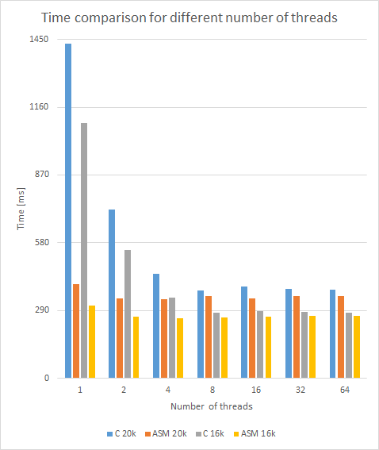

# BMPScalingBy2SIMD
A program that scales a bitmap 2 times in the BMP format using the "nearest neighbor" method and using SIMD instructions

> One of the simpler ways of increasing image size is nearest-neighbor interpolation, replacing every pixel with the nearest pixel in the output; for upscaling this means multiple pixels of the same color will be present. [...] 'Nearest' in nearest-neighbor doesn't have to be the mathematical nearest. One common implementation is to always round towards zero. [...]
> [Wikipedia](https://en.wikipedia.org/wiki/Image_scalingn)
>> 
>> 

## Technologies
The assembler library uses **AVX / AVX2** (256-bit instructions) and **SSE2 / SSE4.1** (128-bit instructions) instructions, so it can process 16 pixels (48 sub-pixels, 32 in 256-bit register and 16 in 128-bit) at the same time.

## Setup
Processor that supports at least AVX2 instructions.

The application is used for BMP files with 24-bit color depth and 54-byte header.

##### Input parameters (with default parameters):
- `-s <file name>` - source file name,
  - `i.bmp`,
- `-d <file name>` - output file name,
  - `o.bmp`,
- `-t <number of threads>` - number of threads the application should call. When <1, the application itself decides how much to call,
  - Number of concurrent threads supported. If the value is not well defined or not computable, returns 1.

## Speed comparison

*i7-8550U (4 cores, 8 threads) 20k/10800p - 16176 x 10800, 15k - 15360 x 8640*

## Project status
- There are definitely many things that can be improved to make the project even more efficient.
- Some code snippets are not in English.

## Sources
https://tech-algorithm.com/articles/nearest-neighbor-image-scaling/